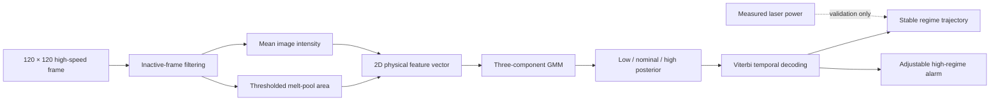
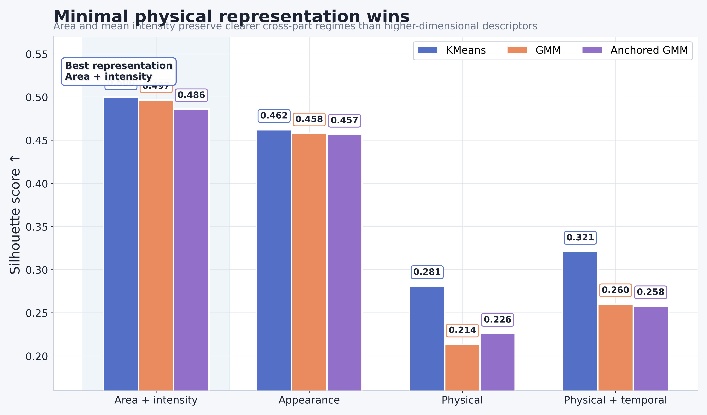
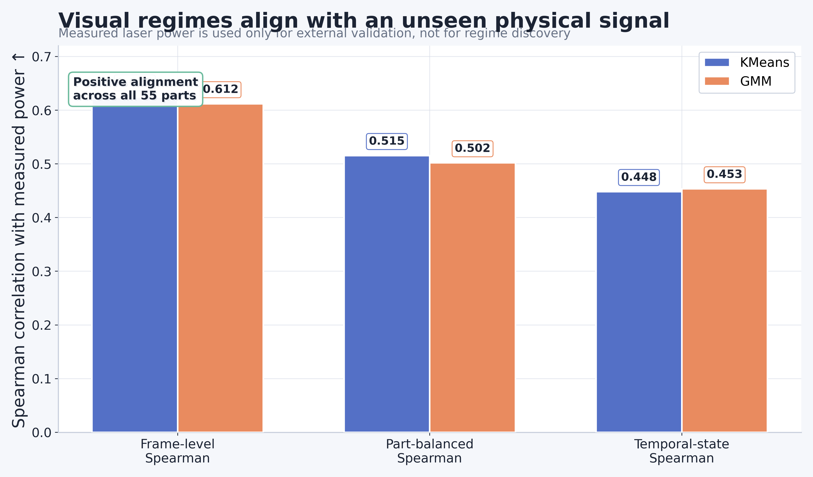
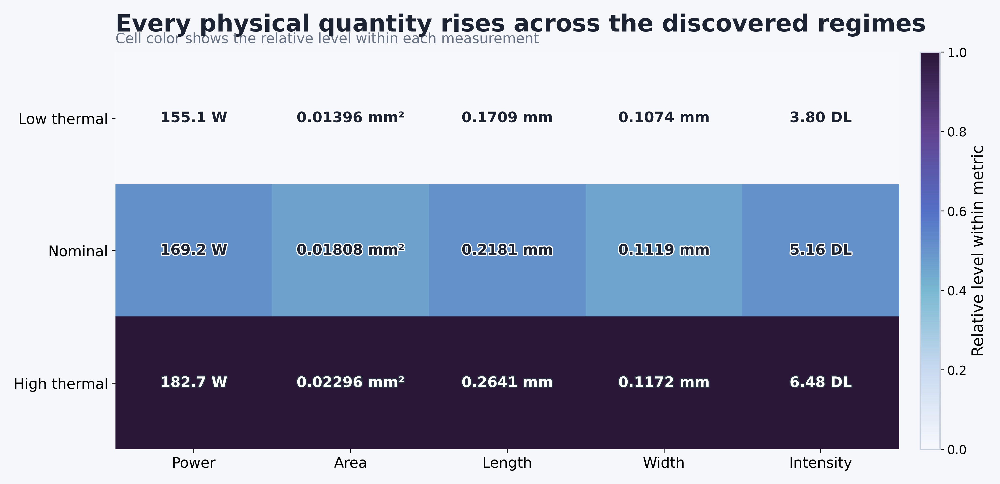
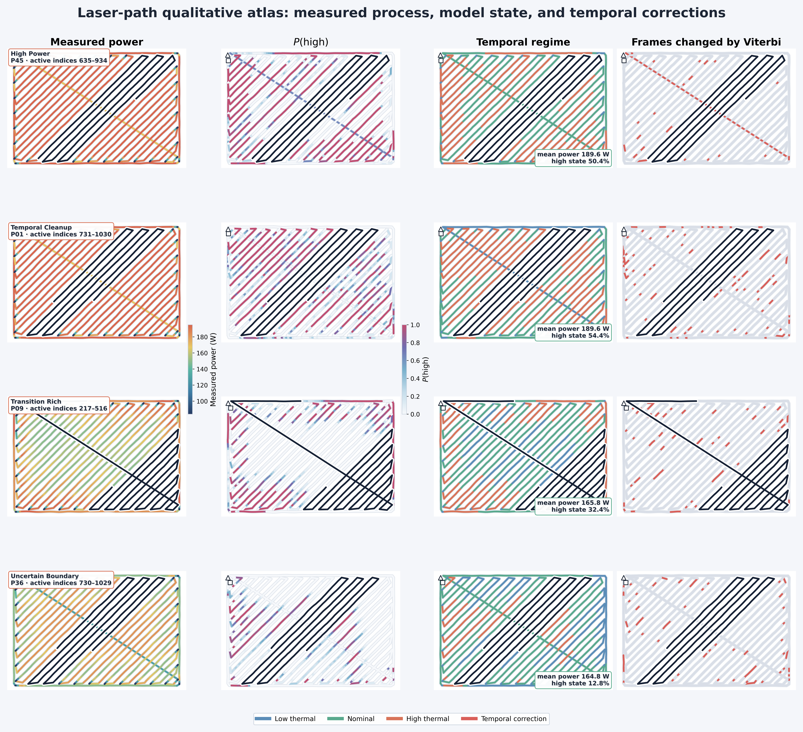

<div align="center">

# PhysMelt

### Physics-Aligned Probabilistic Regime Tracking for High-Speed Melt-Pool Monitoring

[](https://www.python.org/)
[](#)
[](#)
[](https://doi.org/10.18434/mds2-2507)
[](#)

**PhysMelt discovers physically meaningful thermal regimes from high-speed
melt-pool video using only two interpretable image features.**

[Method](#method) ·
[Results](#main-results) ·
[Reproduction](#reproduction) ·
[Qualitative analysis](#qualitative-analysis) ·
[Repository structure](#repository-structure)

</div>

---

## Overview

PhysMelt is a lightweight monitoring pipeline for laser-based additive
manufacturing. It converts high-speed melt-pool video into a temporally stable,
probabilistic process-state signal without using defect annotations or measured
laser power during training.

The central result is deliberately simple:

> **Thresholded melt-pool area and mean image intensity are sufficient to
> recover low-, nominal-, and high-thermal process regimes that align with
> independently measured laser power.**

The final configuration uses:

1. direct decoding of uncompressed high-speed AVI frames;
2. inactive-frame filtering;
3. melt-pool area and mean image intensity;
4. a three-component Gaussian mixture model;
5. physically ordered low, nominal, and high thermal states;
6. Viterbi decoding for temporal stabilization;
7. adjustable high-regime probabilities for process alarms.

PhysMelt is intended as an interpretable process-monitoring method rather than a
black-box defect classifier.

---

## Why PhysMelt?

Many monitoring pipelines increase model complexity before establishing whether
simple physical image measurements already contain the required process signal.
PhysMelt takes the opposite approach.

| Design goal | PhysMelt choice |
|---|---|
| Physical interpretability | Melt-pool area and mean intensity |
| Label-free regime discovery | Three-component GMM |
| Uncertainty | Posterior probability for every frame |
| Temporal consistency | Viterbi state decoding |
| Independent validation | Synchronized measured laser power |
| Lightweight deployment | Two-dimensional input and a tiny state model |
| Transparent evaluation | Part-separated and out-of-fold protocols |

The method avoids treating visually discovered states as verified defects.
Instead, it reports **low-thermal**, **nominal**, and **high-thermal** operating
regimes.

---

## Method



For frame \(t\), the compact representation is

\[
\mathbf{x}_t =
\begin{bmatrix}
A_t \\
I_t
\end{bmatrix},
\]

where \(A_t\) is thresholded melt-pool area and \(I_t\) is mean image
intensity.

A three-component Gaussian mixture model estimates

\[
p(z_t=k \mid \mathbf{x}_t),
\qquad
k \in
\{\text{low},\text{nominal},\text{high}\}.
\]

Components are ordered by their physical feature levels rather than by the
arbitrary component identifiers returned by clustering. Viterbi decoding then
finds a temporally coherent state sequence while suppressing isolated
frame-to-frame switches.

Measured power is **not** supplied to the clustering model. It is retained as
an independent physical validation signal.

---

## Dataset

Experiments use the NIST **Residual Heat Factor** dataset from the Additive
Manufacturing Metrology Testbed:

> Brandon Lane et al.,  
> *Process Monitoring Dataset from the Additive Manufacturing Metrology
> Testbed: Residual Heat Factor Experiment*  
> DOI: [10.18434/mds2-2507](https://doi.org/10.18434/mds2-2507)

### Dataset summary

| Property | Value |
|---|---:|
| Material | IN625 |
| Experimental parts | 55 |
| Video frames | 82,390 |
| Frames per part | 1,498 |
| Physical acquisition rate | 20,000 frames/s |
| Physical interval per frame | 50 µs |
| Frame resolution | 120 × 120 |
| Image depth | 8-bit intensity |
| Synchronized analysis rows | 82,390 |
| Training defect labels | None |

The synchronized analysis tables contain one row per video frame, including:

- laser X and Y position;
- measured laser power;
- scan speed;
- official melt-pool area;
- melt-pool length and width;
- mean image intensity;
- spatter measurements.

The current study uses measured power only for external validation. Spatter
outputs are treated as secondary because their original processing pipeline was
still under development.

> **Important:** some AVI metadata reports a playback rate of 30 FPS. The
> physical experiment rate is 20,000 FPS.

Raw NIST data is not redistributed in this repository.

---

## Main results

### Physical validation

Five-fold out-of-fold predictions show that the visually inferred
high-thermal posterior follows independently measured laser power.

| Metric | GMM result |
|---|---:|
| Frame-level Spearman \(P(\mathrm{high})\) vs power | **0.612** |
| Part-balanced Spearman | **0.502** |
| Parts with monotonic low → nominal → high power | **55 / 55** |
| Mean high–low measured-power gap | **35.16 W** |
| Temporal switch reduction | **37.8%** |
| Recall on top-10% measured-power frames after decoding | **0.603–0.606** |

### Synchronization agreement

The independently extracted frame measurements closely reproduce the official
synchronized NIST measurements.

| Comparison | Metric | Result |
|---|---|---:|
| Extracted vs official mean intensity | Pearson | **0.99976** |
| Extracted vs official mean intensity | Spearman | **0.99968** |
| Extracted vs official melt-pool area | Pearson | **0.98900** |
| Extracted vs official melt-pool area | Spearman | **0.98193** |

### Discovered regime profiles

The temporally decoded GMM states form an ordered physical progression.

| Regime | Frame share | Power | Area | Length | Width | Intensity |
|---|---:|---:|---:|---:|---:|---:|
| Low thermal | 33.7% | 155.14 W | 0.01396 mm² | 0.1709 mm | 0.1074 mm | 3.797 DL |
| Nominal | 42.7% | 169.21 W | 0.01808 mm² | 0.2181 mm | 0.1119 mm | 5.159 DL |
| High thermal | 23.6% | 182.68 W | 0.02296 mm² | 0.2641 mm | 0.1172 mm | 6.484 DL |

Power, area, melt-pool length, width, and intensity all rise across the
low-to-high regime ordering.

---

## Representation ablation

More features did not automatically produce better regimes.

The compact area-plus-intensity representation obtained approximately:

- **0.500 silhouette** with KMeans;
- **0.497 silhouette** with GMM;
- approximately **0.92 mean posterior confidence** for GMM.

Higher-dimensional physical and temporal descriptors reduced cluster
compactness and produced less stable cross-part assignments. This motivates the
final two-feature PhysMelt configuration.

<p align="center">
  
</p>

<p align="center">
  
</p>

<p align="center">
  
</p>

Additional publication-ready figures are available in:

- [`PLOTS_WOW/PNG`](PLOTS_WOW/PNG)
- [`PLOTS_WOW/PDF`](PLOTS_WOW/PDF)

---

## Qualitative analysis

PhysMelt maps inferred process states back onto the synchronized laser
trajectory. This makes it possible to inspect where high-power exposure,
high-regime probability, state transitions, and temporal corrections occur
along the physical scan path.

<p align="center">
  
</p>

The qualitative atlas contains four automatically selected cases:

| Case | Part | Purpose |
|---|---:|---|
| High measured power | P45 | Strong high-thermal response |
| Temporal cleanup | P01 | Region with extensive Viterbi corrections |
| Transition-rich path | P09 | Frequent thermal-state transitions |
| Uncertain boundary | P36 | High posterior uncertainty |

Detailed temporal panels:

- [`timeline_high_power_P45.png`](PLOTS_QUALITATIVE_PATHS/PNG/timeline_high_power_P45.png)
- [`timeline_temporal_cleanup_P01.png`](PLOTS_QUALITATIVE_PATHS/PNG/timeline_temporal_cleanup_P01.png)
- [`timeline_transition_rich_P09.png`](PLOTS_QUALITATIVE_PATHS/PNG/timeline_transition_rich_P09.png)
- [`timeline_uncertain_boundary_P36.png`](PLOTS_QUALITATIVE_PATHS/PNG/timeline_uncertain_boundary_P36.png)

Each panel compares:

1. synchronized measured power;
2. \(P(\mathrm{high})\);
3. official melt-pool area and intensity;
4. raw GMM assignments;
5. temporally stabilized assignments;
6. frames changed by Viterbi decoding.

---

## Repository structure

```text
PhysMelt/
├── scripts/
│   ├── audit_videos.py
│   ├── audit_videos_cv2.py
│   ├── build_feature_dataset.py
│   ├── extract_frame_features.py
│   ├── finalize_physmelt.py
│   ├── inspect_nist_archives.py
│   ├── inspect_nist_sync.py
│   ├── inspect_raw_avi.py
│   ├── make_physmelt_qualitative_paths.py
│   ├── make_wow_plots.py
│   ├── run_all_feature_extraction.py
│   ├── run_physmelt_full.py
│   └── validate_nist_physics.py
│
├── data/
│   ├── features/
│   │   └── frame_features/
│   ├── manifests/
│   └── model_cache/
│
├── outputs/
│   ├── reports/
│   ├── physical_validation/
│   └── final_evaluation/
│
├── logs/
├── PLOTS_WOW/
│   ├── PDF/
│   └── PNG/
│
└── PLOTS_QUALITATIVE_PATHS/
    ├── PDF/
    ├── PNG/
    └── qualitative_manifest.csv
```

### Main scripts

| Script | Purpose |
|---|---|
| `inspect_raw_avi.py` | Inspect the RIFF/AVI structure without OpenCV |
| `audit_videos.py` | Audit the available high-speed videos |
| `extract_frame_features.py` | Decode AVI frames and extract physical and appearance features |
| `run_all_feature_extraction.py` | Run feature extraction over all 55 parts |
| `build_feature_dataset.py` | Assemble frame-level features and metadata |
| `run_physmelt_full.py` | Run clustering, GMM, temporal decoding, ablations, and evaluation |
| `inspect_nist_archives.py` | Inspect the downloaded NIST archives |
| `inspect_nist_sync.py` | Verify synchronized NIST analysis tables |
| `validate_nist_physics.py` | Perform independent physical and out-of-fold validation |
| `finalize_physmelt.py` | Evaluate alarms, lightweight inference, and final outputs |
| `make_wow_plots.py` | Generate publication-ready quantitative plots |
| `make_physmelt_qualitative_paths.py` | Visualize regimes along synchronized laser paths |

The primary AVI decoder is implemented directly with Python, `struct`, and
NumPy. OpenCV is not required for the main extraction pipeline.

---

## Installation

The current scripts assume that the repository is located at:

```text
~/PhysMelt
```

Clone through SSH:

```bash
git clone git@github.com:cataug/PhysMelt.git "$HOME/PhysMelt"
cd "$HOME/PhysMelt"
```

Create a clean environment:

```bash
python3 -m venv .venv
source .venv/bin/activate

python3 -m pip install --upgrade pip
python3 -m pip install numpy scipy scikit-learn matplotlib
```

No GPU is required. The complete pipeline is CPU-compatible.

---

## Data preparation

Download the NIST dataset from:

```text
https://doi.org/10.18434/mds2-2507
```

Place the melt-pool AVI files under:

```text
~/PhysMelt/data/raw/NIST_RHF/MPM_AVIs/
```

Expected layout:

```text
data/raw/NIST_RHF/
├── MPM_AVIs/
│   ├── P01.avi
│   ├── P02.avi
│   ├── ...
│   └── P55.avi
│
├── RHF_Analysis_Results.zip
├── RHF_Encoder.zip
└── RHF_MP_Area.zip
```

Raw videos and archives are intentionally excluded from Git.

---

## Reproduction

### 1. Audit the video collection

```bash
python3 scripts/audit_videos.py
python3 scripts/inspect_raw_avi.py
```

### 2. Extract frame-level features

```bash
python3 scripts/run_all_feature_extraction.py
```

Extracted files are written to:

```text
data/features/frame_features/
```

### 3. Run the main PhysMelt experiments

```bash
python3 scripts/run_physmelt_full.py
```

This stage evaluates:

- KMeans;
- Gaussian mixture models;
- anchored GMM variants;
- multiple feature representations;
- seed stability;
- part-separated protocols;
- temporal Viterbi decoding.

### 4. Inspect and align the synchronized NIST measurements

```bash
python3 scripts/inspect_nist_archives.py
python3 scripts/inspect_nist_sync.py
```

### 5. Perform independent physical validation

```bash
python3 scripts/validate_nist_physics.py
```

This produces:

- extracted-to-official feature agreement;
- five-fold out-of-fold predictions;
- power-posterior correlations;
- part-wise regime ordering;
- regime physical profiles;
- temporal switch-reduction statistics.

### 6. Run final alarm and deployment-oriented evaluation

```bash
python3 scripts/finalize_physmelt.py
```

### 7. Regenerate quantitative figures

```bash
python3 scripts/make_wow_plots.py
```

### 8. Regenerate laser-path qualitative figures

```bash
python3 scripts/make_physmelt_qualitative_paths.py
```

---

## Outputs

### Quantitative evaluation

```text
outputs/reports/
```

Contains experiment summaries, ablations, stability measurements, tables, and
model-comparison outputs.

### Physical validation

```text
outputs/physical_validation/
```

Contains synchronized official measurements, out-of-fold predictions,
part-level validation, regime profiles, and validation summaries.

### Alarm and edge evaluation

```text
outputs/final_evaluation/
```

Contains probability-threshold evaluations, event-level alarms, lightweight
model benchmarks, and final evaluation reports.

### Figures

```text
PLOTS_WOW/
PLOTS_QUALITATIVE_PATHS/
```

Both vector PDF and high-resolution PNG versions are retained.

---

## Interpretation

PhysMelt supports the following conclusions:

- high-speed melt-pool frames contain a strong low-dimensional thermal signal;
- a two-feature representation can outperform more elaborate handcrafted
  descriptors;
- soft GMM posteriors provide a useful process-state confidence measure;
- temporal decoding removes short-lived regime flicker;
- visually discovered states exhibit ordered measured-power profiles;
- the same states can be projected back onto the physical laser path.

The method does **not** establish that every high-thermal segment is a defect.
It detects a physically aligned operating regime that may be used for
monitoring, triage, adaptive sensing, or downstream quality analysis.

---

## Limitations

- The current study uses a controlled NIST residual-heat experiment on an IN625
  plate rather than a complete powder-bed production process.
- No direct porosity, keyhole, balling, or final-part defect labels are used.
- Thermal regimes should not be interpreted as defect categories without
  additional metallographic validation.
- Python AVI decoding is designed for reproducible analysis, not guaranteed
  20 kHz real-time deployment.
- Real-time integration would require optimized C/C++, FPGA, camera-side, or
  embedded implementation.
- Transfer to other machines, alloys, cameras, and exposure conditions remains
  to be evaluated.

---


## Acknowledgements

This project uses the NIST Additive Manufacturing Metrology Testbed Residual
Heat Factor dataset:

> Lane, B. et al.  
> *Process Monitoring Dataset from the Additive Manufacturing Metrology
> Testbed: Residual Heat Factor Experiment.*  
> National Institute of Standards and Technology.  
> DOI: [10.18434/mds2-2507](https://doi.org/10.18434/mds2-2507)

---

<div align="center">

**Interpretable features · Probabilistic states · Physical validation · Temporal stability**

</div>
